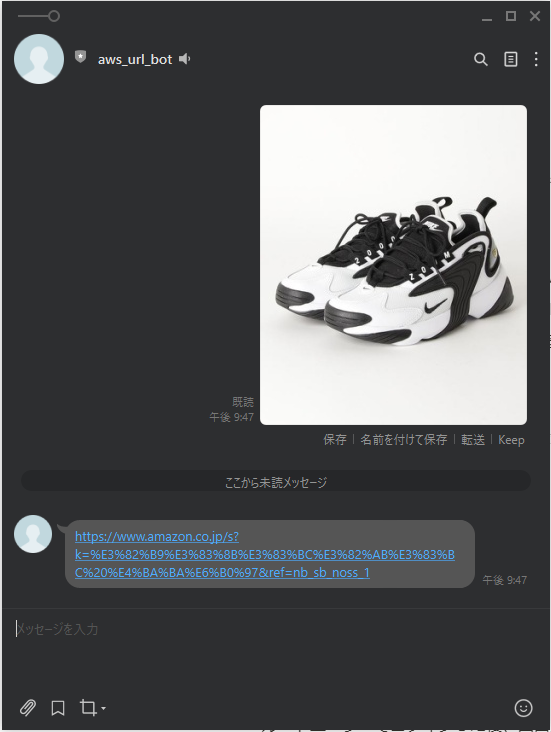

# AWS × Line bot 構築手順

※AWSアカウント、LINE Developersアカウントは作成済みとする。

**目次**

**０：今回のゴール**

**１：AWS IAMユーザー作成編**

**２：LINE Developers編**

　　（１）プロバイダーを作成する

　　（２）チャネルを作成する

　　（３）チャネルアクセストークンを発行する

**３：AWS編**

　　（１）GitHubからソースをダウンロードする

　　（２）Lambda関数を作成する

　　（３）トリガーを追加する（API Gatewayの設定）

　　（４）APIエンドポイントをLINE DevelopersのチャネルのWeb hookに設定する

　　（５）Lambda関数のロールを作成する

　　（６）デプロイする

**４：リソースの削除方法**

　　（１）API Gatewayの削除

　　（２）AWS Lambdaの削除

　　（３）IAMユーザーの削除

　　（４）チャネルの削除

　　（５）プロバイダーの削除

# 【**０：今回のゴール**】

・画像を送信すると、その画像に関する人気商品のAmazonページのURLが返ってくるLINE Botを

　作成する！！！

　

# 【**１：AWS IAMユーザー作成編**】

・ルートユーザーでログインした後、画面上部の検索にてIAMと入力し、IAMダッシュボードへ

・左ペインから「ユーザー」を選択し、「ユーザーを追加」ボタンを押下。

・ユーザー追加の為の設定を、以下に従って行う。

　（１）ユーザー名⇒任意で入力（例：ご自身の名前）

　　　　アクセスの種類⇒ふたつともチェック

　　　　コンソールのパスワード⇒自動生成パスワードにチェック

　　　　パスワードのリセットが必要⇒チェック

　　　　　⇒次のステップへ！

　（２）既存のポリシーを直接アタッチを選択。

　　　　ポリシー群から「AdministratorAccess」にチェックを入れる

　　　　　⇒次のステップへ！

　（３）タグの追加は不要なので、次のステップへ！

　（４）設定内容を確認し、「ユーザーの作成」を押下。

　（５）成功と表示されるので、ユーザー情報のCSVファイルをダウンロード。

　（６）ログアウトする。

　（７）ユーザー情報のCSVファイル内に記載してあるURLにアクセス。

　（８）CSVファイル記載のパスワードを入力し、サインイン。

　（９）パスワードの変更を実施。

　　　　設定時のポリシーは以下。

　　　　・パスワードの文字数制限: 8～128 文字

　　　　・大文字、小文字、数字、! @ # $ % ^ & * ( ) _ + - = { } | ' 記号のうち、

　　　　　最低 3 つの文字タイプの組み合わせ

　　

　以上でIAMユーザー作成は終了です！

# **【２：LINE Developers編】**

### **（１）プロバイダーを作成する**

　　　コンソール画面にて、プロバイダーの「作成」ボタンをクリック。

　　　プロバイダー名は任意。（例：sample provider）

### **（２）チャネルを作成する**

　　　Messaging APIを選択。

　　　

　　　以下項目を入力し、作成ボタン押下。

　　　・チャネル名（LINEアカウント名になります。例：url_bot）

　　　・チャネル説明（任意。例：amazonのurlを返却するbotです。）

　　　・大業種（任意。例：個人）

　　　・小業種（任意。例：個人（IT・コンピュータ））

　　　・メールアドレス（例：hogeline@hogeline.com）

　　　「以下の内容でMessaging APIを作成しますか？」⇒OK

　　　情報利用に関する同意について⇒同意する

### **（３）チャネルアクセストークンを発行する**

　　　Messaging API設定タブ内の下部にある「発行」ボタンを押下。

# **【３：AWS編】**

### **（１）GitHubからソースをダウンロードする**

　　　緑色の「Code」を押下し、zip形式でダウンロード。

### **（２）Lambda関数を作成する**

　　　画面左上の「サービス」プルダウンから「Lambda」を選択。

　　　「関数の作成」を押下。

　　　

　　　以下条件で設定する。

　　　・一から作成を選択

　　　・関数名…任意。（例：url_bot）

　　　・ランタイム…Python3.8

　　　・アクセス権限…「基本的なLambdaアクセス権限で新しいロールを作成」

　　　設定後、「関数の作成」ボタンを押下。

　　　

　　　Lambda関数が作成されるので、以下を実施。

　　　・ソースコード配置

　　　・環境変数（発行したLINEのチャンネルアクセストークン）を設定

　　　　キー…LINE_CHANNEL_ACCESS_TOKEN

　　　　値…１の（３）にて発行したアクセストークンをコピペ

### **（３）トリガーを追加する（API Gatewayの設定）**

　　　関数の概要から、「トリガーを追加」ボタンを押下。

　　　トリガーの設定は、以下の通りに設定し、「作成」ボタンを押下する。

　　　・API Gatewayを選択

　　　・API…「APIを作成する」を選択

　　　・APIタイプ…REST API

　　　・セキュリティ…オープン

　　　・API名…任意。（例：url_api）

　　　・デプロイされるステージ…defaultでOK

### **（４）APIエンドポイントをLINE DevelopersのチャネルのWeb hookに設定**

　　　Lambdaの設定タブのトリガーからAPI Gatewayの詳細を表示すると

　　　APIエンドポイントが表示されるので、コピー。

　　　作成したチャネルの「Messaging API設定」タブから、Webhook URLに

　　　先ほどコピーしたAPIエンドポイントを設定し、更新ボタンを押下。

　　　Webhookの利用をオンにする。

### **（５）Lambda関数のロールを作成する**

　　　Lambda関数にて、Amazon Rekognitionを利用できるよう権限を作成する。

　　　

　　　画面左上の「サービス」プルダウンから「IAM」を選択した後、

　　　画面左側のダッシュボードから「ロール」を押下する。

　　　

　　　「ロールの作成」ボタンを押下する。

　　　ユースケースの選択にて「Lambda」を選択し、

　　　Attachアクセス権限ポリシーにて以下にチェックを付ける。

　　　・AmazonRekognitionFullAccess

　　　・CloudWatchLogsFullAccess

　　　

　　　以降、確認画面に遷移するまでは設定の変更は不要。

　　　（「次のステップ」ボタン連打で大丈夫です。）

　　　

　　　確認画面にて、ロール名を入力する。（任意。例：lambda_rekognition_role）

　　　ポリシーが正しく設定されているか確認し、「ロールの作成」ボタンを押下する。

　　　

　　　作成したロールを、Lambda関数の実行ロールとして設定する。

　　　Lambda関数のコンソールから、設定タブ≫アクセス権限≫実行ロールの「編集」ボタン

　　　を押下する。

　　　先ほど作成したロールを、実行ロールとして設定する。

### **（６）デプロイする**

　　　

# 【**４：リソースの削除方法**】

### （１）API Gatewayの削除

　　　画面左上のサービスからAPI Gatewayを選択し、APIを表示する。

　　　API名左側のチェックを入れ、画面右側のアクションボタンから、Deleteを押下。

　　　削除するかどうか聞かれるので、削除する。

### （２）AWS Lambdaの削除

　　　画面左上のサービスからLambdaを選択し、関数を表示する。

　　　関数名左側のチェックを入れ、画面右側のアクションボタンから、削除を押下。

　　　削除するかどうか聞かれるので、削除する。

### （３）IAMユーザーの削除

　　　画面左上のサービスからIAMを選択し、ユーザーを表示する。

　　　ユーザー名左側のチェックを入れ、ユーザーの削除ボタンを押下。

　　　チェックボックスにチェックを入れ、削除する。

### （４）チャネルの削除

　　　チャネル基本設定タブの最下部にある、削除ボタンを押下。

　　　LINE Official Account Managerを表示ボタンを押下。

　　　同意の箇所にチェックを入れ、アカウントを削除する。

### （５）プロバイダーの削除

　　　プロバイダー設定タブの最下部にある、削除ボタンを押下。

　　　削除しますか？と聞かれるので、削除する。

