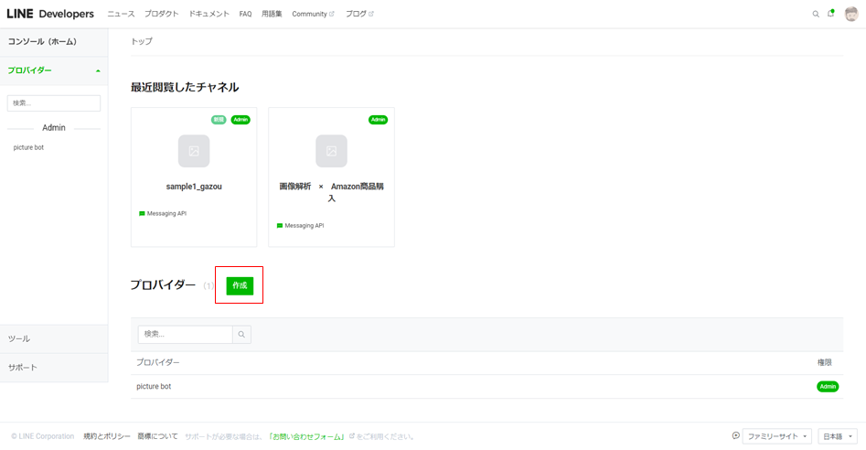

# AWS × Line bot 構築手順

※AWSアカウント、LINE Developersアカウントは作成済みとする。

**目次**

**０：AWS IAMユーザー作成編**

**１：LINE Developers編**

　　（１）プロバイダーを作成する

　　（２）チャネルを作成する

　　（３）チャネルアクセストークンを発行する

**２：AWS編**

　　（１）Lambda関数を作成する

　　（２）トリガーを追加する（API Gatewayの設定）

　　（３）APIエンドポイントをLINE DevelopersのチャネルのWeb hookに設定する

　　（４）Lambda関数のロールを作成する

　　（５）デプロイする

【**０：AWS IAMユーザー作成編**】

・ルートユーザーでログインした後、画面上部の検索にてIAMと入力し、IAMダッシュボードへ

・左ペインから「ユーザー」を選択し、「ユーザーを追加」ボタンを押下。

・ユーザー追加の為の設定を、以下に従って行う。

　（１）ユーザー名⇒任意で入力

　　　　アクセスの種類⇒ふたつともチェック

　　　　コンソールのパスワード⇒自動生成パスワードにチェック

　　　　パスワードのリセットが必要⇒チェック

　　　　　⇒次のステップへ！

　（２）既存のポリシーを直接アタッチを選択。

　　　　ポリシー群から「AdministratorAccess」にチェックを入れる

　　　　　⇒次のステップへ！

　（３）タグの追加は不要なので、次のステップへ！

　（４）設定内容を確認し、「ユーザーの作成」を押下。

　（５）成功と表示されるので、ユーザー情報のCSVファイルをダウンロード。

　（６）ログアウトし、再度ログイン画面へ。

　（７）サインイン時、「IAMユーザー」を選択。

　　　　アカウントID（CSVファイルのConsole login linkのURL内の、12桁の数字）を

　　　　入力し、「次へ」押下。

　（８）設定したユーザー名、CSVファイル記載のパスワードを入力し、サインイン。

　（９）パスワードの変更を実施。

　以上でIAMユーザー作成は終了です！

**【１：LINE Developers編】**

**（１）プロバイダーを作成する**

　　　コンソール画面にて、プロバイダーの「作成」ボタンをクリック。

　　　プロバイダー名は任意。

**（２）チャネルを作成する**

　　　Messaging APIを選択。

　　　

　　　以下項目を入力し、作成ボタン押下。

　　　・チャネル名（LINEアカウント名になります）

　　　・チャネル説明

　　　・大業種

　　　・小業種

　　　・メールアドレス

　　　「以下の内容でMessaging APIを作成しますか？」⇒OK

　　　情報利用に関する同意について⇒同意する

**（３）チャネルアクセストークンを発行する**

　　　Messaging API設定タブ内の下部にある「発行」ボタンを押下。

**【２：AWS編】**

**（１）Lambda関数を作成する**

　　　画面左上の「サービス」プルダウンから「Lambda」を選択。

　　　「関数の作成」を押下。

　　　

　　　以下条件で設定する。

　　　・一から作成を選択

　　　・関数名…任意

　　　・ランタイム…Python3.8

　　　・アクセス権限…「基本的なLambdaアクセス権限で新しいロールを作成」

　　　設定後、「関数の作成」ボタンを押下。

　　　

　　　Lambda関数が作成されるので、以下を実施。

　　　・ソースコード配置

　　　・環境変数（発行したLINEのチャンネルアクセストークン）を設定

　　　　キー…LINE_CHANNEL_ACCESS_TOKEN

　　　　値…１の（３）にて発行したアクセストークンをコピペ

**（２）トリガーを追加する（API Gatewayの設定）**

　　　関数の概要から、「トリガーを追加」ボタンを押下。

　　　トリガーの設定は、以下の通りに設定し、「作成」ボタンを押下する。

　　　・API Gatewayを選択

　　　・API…「APIを作成する」を選択

　　　・APIタイプ…REST API

　　　・セキュリティ…オープン

　　　・API名…任意

　　　・デプロイされるステージ…defaultでOK

**（３）APIエンドポイントをLINE DevelopersのチャネルのWeb hookに設定する**

　　　Lambdaの設定タブのトリガーからAPI Gatewayの詳細を表示すると

　　　APIエンドポイントが表示されるので、コピー。

　　　作成したチャネルの「Messaging API設定」タブから、Webhook URLに

　　　先ほどコピーしたAPIエンドポイントを設定し、更新ボタンを押下。

　　　Webhookの利用をオンにする。

**（４）Lambda関数のロールを作成する**

　　　Lambda関数にて、Amazon Rekognitionを利用できるよう権限を作成する。

　　　

　　　画面左上の「サービス」プルダウンから「IAM」を選択した後、

　　　画面左側のダッシュボードから「ロール」を押下する。

　　　

　　　「ロールの作成」ボタンを押下する。

　　　ユースケースの選択にて「Lambda」を選択し、

　　　Attachアクセス権限ポリシーにて以下にチェックを付ける。

　　　・AmazonRekognitionFullAccess

　　　・CloudWatchLogsFullAccess

　　　

　　　以降、確認画面に遷移するまでは設定の変更は不要。

　　　（「次のステップ」ボタン連打で大丈夫。）

　　　

　　　確認画面にて、ロール名を入力する。（任意名）

　　　ポリシーが正しく設定されているか確認し、「ロールの作成」ボタンを押下する。

　　　

　　　作成したロールを、Lambda関数の実行ロールとして設定する。

　　　Lambda関数のコンソールから、設定タブ≫アクセス権限≫実行ロールの「編集」ボタン

　　　を押下する。

　　　先ほど作成したロールを、実行ロールとして設定する。

**（５）デプロイする**

　　　

